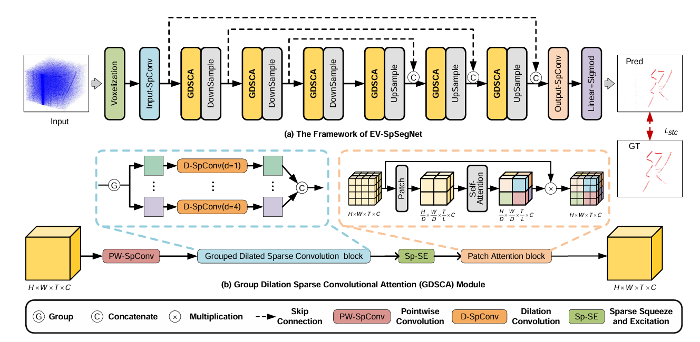

# EVSOD

## 基于 EV-SpSegNet 的事件相机微小目标检测复现与改进

EVSOD 是一个用于复现、评估和改进 **EV-SpSegNet** 的研究仓库，面向 EV-UAV 事件相机无人机微小目标检测基准。

> 本仓库基于 ICCV 2025 论文 *Event-based Tiny Object Detection: A Benchmark Dataset and Baseline* 的官方实现整理。EV-SpSegNet、EV-UAV 数据集和预训练权重的原始贡献均属于原论文作者；本仓库不将基线方法或数据集作为新的方法或数据集主张。

---

## 操作导航

| 目标 | 使用的脚本或配置 | 是否写入预测文本 |
| --- | --- | --- |
| 测试官方预训练权重 | `test.py` + `evisseg_evuav.yaml` | 否 |
| 检查训练流程是否可运行 | `train.py` + `evisseg_evuav_smoke.yaml` | 否 |
| 在 4GB 显存设置下训练 | `train.py` + `evisseg_evuav_4gb.yaml` | 否 |
| 从头训练完整基线 | `train.py` + `evisseg_evuav_scratch.yaml` | 否 |
| 在赛道二验证集上计算指标和总分 | `test2.py` + `evisseg_evuav_challenge2.yaml` | 否 |
| 生成赛道二提交文件 | `submit_challenge2.py` + `evisseg_evuav_challenge2.yaml` | 是，生成 `val-pred-txt/*.txt` |

---

## 目录结构

```text
EVSOD/
|-- configs/
|   |-- evisseg_evuav.yaml              # 官方预训练权重测试配置
|   |-- evisseg_evuav_4gb.yaml          # 4GB 显存训练配置
|   |-- evisseg_evuav_smoke.yaml        # 1 epoch 烟雾测试配置
|   |-- evisseg_evuav_scratch.yaml      # 完整事件数的从头训练配置
|   `-- evisseg_evuav_challenge2.yaml   # 赛道二验证与评分配置
|-- dataset/
|   |-- EV-UAV-dataset/                 # 原始本地数据集，不提交到 Git
|   `-- 训练集、验证集/                  # 赛道二官方数据包，不提交到 Git
|-- lib/hais_ops/                        # 自定义 CUDA 扩展 HAIS_OP
|-- model/                               # EV-SpSegNet 网络实现
|-- utils/                               # STC Loss 和评估工具
|-- train.py                             # 训练入口
|-- test.py                              # 原始测试集评估入口
|-- test2.py                             # 赛道二验证集评分入口
|-- submit_challenge2.py                 # 赛道二提交文本生成入口
`-- log/                                 # 本地权重、预测和实验结果，不提交到 Git
```

`.gitignore` 会排除数据集、权重、日志、MLflow 记录和 CUDA 编译产物。不要执行会把这些本地文件加入版本库的强制提交操作。

---

## 方法摘要

EV-SpSegNet 将事件相机微小目标检测建模为稀疏点云分割问题。运动目标在时空事件点云中通常形成连续轨迹，而背景噪声更常表现为孤立、弱相关的事件。

基线由以下部分组成：

- **GDSCA**：分组空洞稀疏卷积，用于提取多尺度时空特征。
- **Sp-SE**：稀疏特征融合模块。
- **Patch Attention**：用于体素下采样和全局上下文建模。
- **STC Loss**：时空相关损失，保留具有连续性的目标事件并抑制孤立背景事件。



EV-UAV 基准包含 147 段带事件级标注的序列。原论文报告的无人机目标平均尺寸约为 6.8 x 5.4 像素，属于极小目标检测场景。

---

## 环境配置

### 已验证的软件版本

| 组件 | 版本 |
| --- | --- |
| WSL | Ubuntu + NVIDIA GPU 支持 |
| Python | 3.9 |
| PyTorch | 1.9.1 + CUDA 11.1 (`cu111`) |
| torchvision | 0.10.1 + CUDA 11.1 (`cu111`) |
| 编译 HAIS_OP 使用的 CUDA Toolkit | CUDA 11.x，仅从源码编译时需要 |
| NumPy | `< 2` |

以下命令以当前项目路径为例：

```bash
export PROJECT_DIR=/mnt/d/AI/ESOD/EV-UAV-main
```

开始前确认 WSL 能识别显卡：

```bash
nvidia-smi
```

### 1. 下载 CUDA 版 PyTorch wheel

为避免 conda 自动安装 CPU 版 PyTorch，使用 Python 3.9 对应的 CUDA 11.1 wheel。下载中断后重复执行相同命令即可续传。

```bash
mkdir -p "$HOME/.cache/evuav-wheels"
cd "$HOME/.cache/evuav-wheels"

curl -fL -C - --retry 20 --retry-all-errors --connect-timeout 20 \
  -o torch-1.9.1+cu111-cp39-cp39-linux_x86_64.whl \
  "https://mirrors.aliyun.com/pytorch-wheels/cu111/torch-1.9.1%2Bcu111-cp39-cp39-linux_x86_64.whl"

curl -fL -C - --retry 20 --retry-all-errors --connect-timeout 20 \
  -o torchvision-0.10.1+cu111-cp39-cp39-linux_x86_64.whl \
  "https://mirrors.aliyun.com/pytorch-wheels/cu111/torchvision-0.10.1%2Bcu111-cp39-cp39-linux_x86_64.whl"
```

若 `curl` 长时间保持 `0 B/s`，通常是镜像暂时无响应。不要安装未下载完整的 `.whl` 文件。

### 2. 创建 conda 环境

```bash
conda create -n EV39 python=3.9 pip -y
conda activate EV39
```

如需完全重建同名环境：

```bash
conda env remove -n EV39 -y
```

### 3. 安装 Python 依赖

以下命令使用阿里云 PyPI 镜像安装除 PyTorch 外的依赖：

```bash
python -m pip install --upgrade pip
python -m pip install -i https://mirrors.aliyun.com/pypi/simple/ \
  numpy==1.23.5 pyyaml==6.0.2 tqdm==4.66.5 pandas==2.0.3 \
  opencv-python==4.8.1.78 mlflow==2.17.2 spconv-cu111 \
  typing-extensions==4.12.2 pillow==10.4.0
```

### 4. 安装 CUDA 版 PyTorch

```bash
python -m pip install --no-deps \
  "$HOME/.cache/evuav-wheels/torch-1.9.1+cu111-cp39-cp39-linux_x86_64.whl" \
  "$HOME/.cache/evuav-wheels/torchvision-0.10.1+cu111-cp39-cp39-linux_x86_64.whl"
```

验证 GPU PyTorch：

```bash
python -c "import torch; print('torch:', torch.__version__, 'cuda:', torch.version.cuda, 'available:', torch.cuda.is_available())"
```

输出中必须包含 `cuda: 11.1` 和 `available: True`。

### 5. 配置 HAIS_OP

`HAIS_OP` 是项目使用的自定义 CUDA 扩展。`lib/hais_ops/build/` 是本地编译产物，被 `.gitignore` 排除，因此 GitHub 新克隆的仓库不包含预编译二进制文件。

已有 Python 3.9 预编译产物时，在每个新 WSL 终端执行：

```bash
conda activate EV39
export PROJECT_DIR=/mnt/d/AI/ESOD/EV-UAV-main
export PYTHONPATH=$PROJECT_DIR/lib/hais_ops/build/lib.linux-x86_64-cpython-39:$PYTHONPATH
export LD_LIBRARY_PATH=$CONDA_PREFIX/lib/python3.9/site-packages/torch/lib:$CONDA_PREFIX/lib:/usr/lib/wsl/lib:$LD_LIBRARY_PATH
cd $PROJECT_DIR
python -c "import torch; import spconv.pytorch; import HAIS_OP; print('HAIS_OP ok')"
```

全新克隆且没有预编译产物时，需要完整 CUDA Toolkit、兼容的 C++ 编译器及 `libsparsehash-dev`，随后从源码编译：

```bash
sudo apt update
sudo apt install -y build-essential libsparsehash-dev ninja-build

cd $PROJECT_DIR/lib/hais_ops
export CUDA_HOME=/path/to/your/cuda
export PATH=$CUDA_HOME/bin:$PATH
export LD_LIBRARY_PATH=$CUDA_HOME/lib64:$LD_LIBRARY_PATH
export CPLUS_INCLUDE_PATH=/usr/include:$CONDA_PREFIX/include:$CPLUS_INCLUDE_PATH
python setup.py build_ext develop
python -c "import HAIS_OP; print('HAIS_OP ok')"
```

`nvcc --version` 必须能正常输出版本。若 CUDA 报错 `g++` 版本过高，请安装与当前 CUDA Toolkit 兼容的 GCC/G++，并通过 `CC`、`CXX`、`CUDAHOSTCXX` 显式指定。

---

## 数据集与权重

数据集、预训练权重、训练日志和实验结果均不会提交到本仓库，请通过原项目官方链接下载：

- EV-UAV 数据集：[百度网盘](https://pan.baidu.com/s/15pAlu3KP1uXych-c3SC5qA?pwd=sbr2)（提取码：`sbr2`）或 [Google Drive](https://drive.google.com/drive/folders/1VIkBFx5Po0KPIFBYOL_appLVie5wgdyi?usp=drive_link)
- EV-SpSegNet 预训练权重：[百度网盘](https://pan.baidu.com/s/1e6a_Ool5WZ3cBMPvoJvWbg?pwd=ztp4)（提取码：`ztp4`）或 [Google Drive](https://drive.google.com/file/d/1nNZsckiN0qp2oo1uX40tU6oz3mUcrSHq/view?usp=drive_link)

基础数据集目录应包含：

```text
dataset/EV-UAV-dataset/
|-- train/
|-- val/
`-- test/
```

赛道二官方数据包应包含：

```text
dataset/训练集、验证集/
|-- train/
|-- val/
`-- val_Challenge2.py
```

运行前，请确认 YAML 中的 `DATA.root`、`TRAIN.model_save_root` 和 `TEST.model_path` 都是本机的 WSL 路径。

---

## 基线训练与测试

### 官方预训练权重测试

```bash
python test.py --config configs/evisseg_evuav.yaml
```

本地一次已跑通的参考结果：

```text
iou: 0.5843424201011658
seg_acc: 0.6784908771514893
pd: 0.7846212700841622
fa: 8.493834145404406e-06
```

### 训练烟雾测试

该配置以 `max_events_num: 100000` 训练 1 个 epoch，只用于检查数据读取、CUDA 扩展、前向反向传播、权重保存和评估流程，不代表最终性能。

```bash
python train.py --config configs/evisseg_evuav_smoke.yaml
python test.py --config configs/evisseg_evuav_smoke.yaml
```

### 4GB 显存训练

```bash
python train.py --config configs/evisseg_evuav_4gb.yaml
python test.py --config configs/evisseg_evuav_4gb.yaml
```

该配置在训练时最多随机采样 `100000` 个事件。降低 `max_events_num` 会改变训练点云密度和目标轨迹完整性，因而会影响 `IoU`、`Acc`、`Pd`、`Fa` 和比赛得分。它适合小显存开发和方案筛选，但不能与完整事件数基线直接等价比较。

### 从头训练完整基线

```bash
python train.py --config configs/evisseg_evuav_scratch.yaml
python test.py --config configs/evisseg_evuav_scratch.yaml
```

完整配置使用 `max_events_num: 700000`，显存需求较高。

---

## 赛道二验证与评分

### `test.py`、`test2.py` 与官方提交脚本的区别

| 脚本 | 使用的数据划分 | 作用 | 输出 |
| --- | --- | --- | --- |
| `test.py` | `test/` | 原始项目的测试集评估 | IoU、seg_acc、Pd、Fa |
| `test2.py` | 赛道二数据包中的 `val/` | 本地验证模型并计算赛道二总分 | IoU、Acc、Pd、Fa、Score_Fa、Score |
| `submit_challenge2.py` | 赛道二数据包中的 `val/` | 按官方格式生成比赛提交文件 | 每个视频一个 `val_xxx.txt` |

`test2.py` 不训练模型、不读取 `test/`、也不写提交文本。它加载 YAML 的 `TEST.model_path`，对验证集推理并使用真实标注计算本地指标。

### 运行赛道二验证

默认配置 [configs/evisseg_evuav_challenge2.yaml](configs/evisseg_evuav_challenge2.yaml) 指向：

- 验证集：`dataset/训练集、验证集/val/`
- 权重：`log/baseline_4gb_seed37/best_iou_seed37.pt`

### 赛道二运行前必须确认的配置

| 文件 | 项目 | 需要改成什么 | 是否每次实验都需要改 |
| --- | --- | --- | --- |
| `configs/evisseg_evuav_challenge2.yaml` | `DATA.root` | 赛道二数据包的父目录，例如 `/mnt/d/AI/ESOD/EV-UAV-main/dataset/训练集、验证集`。该目录下必须有 `val/`。 | 仅路径变化时修改。 |
| `configs/evisseg_evuav_challenge2.yaml` | `TEST.model_path` | 当前要评估或提交的 `best_iou_seed37.pt` 的绝对 WSL 路径。`test2.py` 和 `submit_challenge2.py` 都读取此项。 | 每次更换模型权重时修改。 |
| `configs/evisseg_evuav_challenge2.yaml` | `TEST.eval`、`TEST.roc` | 必须保持为 `True`，否则无法计算全部四项指标和总分。 | 不要修改。 |
| `configs/evisseg_evuav_challenge2.yaml` | `TEST.pd_detT`、`TEST.correct_thresh` | 保持比赛/基线评估使用的 `50` 与 `0.0001`。 | 不要为了提高本地分数而随意修改。 |
| `configs/evisseg_evuav_challenge2.yaml` | `TEST.prediction_threshold` | 保持 `0.9`，`test2.py` 与 `submit_challenge2.py` 都读取此项。 | 不要修改，除非比赛官方明确更改规则。 |
| `configs/evisseg_evuav_challenge2.yaml` | `TEST.challenge_output_dir` | 运行 `submit_challenge2.py` 后保存 `val_xxx.txt` 的目录。 | 只在需要更改提交文件位置时修改。 |
| `test2.py`、`submit_challenge2.py` | 权重、阈值和输出路径 | 无需修改，统一从 YAML 读取。 | 不需要修改。 |

`TRAIN` 段的 `epochs`、`lr`、`max_events_num` 在 `test2.py` 推理时不会重新训练模型；它们保留在 YAML 中是为了记录该权重对应的训练设置。

```bash
conda activate EV39
export PROJECT_DIR=/mnt/d/AI/ESOD/EV-UAV-main
export PYTHONPATH=$PROJECT_DIR/lib/hais_ops/build/lib.linux-x86_64-cpython-39:$PROJECT_DIR:$PYTHONPATH
export LD_LIBRARY_PATH=$CONDA_PREFIX/lib/python3.9/site-packages/torch/lib:$CONDA_PREFIX/lib:/usr/lib/wsl/lib:$LD_LIBRARY_PATH
cd $PROJECT_DIR
python test2.py --config configs/evisseg_evuav_challenge2.yaml
```

运行开始时，脚本会打印实际的验证集路径、视频数量、权重路径及预测阈值。若这些信息不符合预期，应停止并修正 YAML，而不是继续比较分数。

### 得分细则

赛道二使用固定预测阈值 `0.9`，并按以下公式计算：

```text
IoU      = |GT ∩ Pred| / |GT ∪ Pred|
Acc      = TP_target / (TP_target + FN_target)
Pd       = TD / AT
Fa       = FD / (N_frame x H x W)

Score_Fa = exp(-10000 x Fa)
Score    = 0.4 x Pd + 0.3 x Score_Fa + 0.2 x IoU + 0.1 x Acc
```

| 指标 | 含义 | 对总分的影响 |
| --- | --- | --- |
| `IoU` | 前景事件预测与真实前景事件的交并比 | 权重 `0.2` |
| `Acc` | 真实目标事件被正确预测为前景的比例 | 权重 `0.1` |
| `Pd` | 被成功检测的目标数占所有目标数的比例 | 权重 `0.4` |
| `Fa` | 每帧、每像素归一化的虚警目标数 | 经指数惩罚后权重 `0.3` |
| `Score_Fa` | `exp(-10000 x Fa)` | `Fa` 越小越接近 `1` |

`Fa` 的指数惩罚很敏感。例如 `Fa` 每增加 `1e-5`，`Score_Fa` 会额外乘以约 `exp(-0.1)`，约为 `0.905`。因此比赛优化不能只看 IoU，也必须控制虚警率。

`test2.py` 使用项目原有 `utils/eval.py` 中的 `Pd/Fa` 实现，分辨率为 `346 x 260`，时间帧宽度和目标判定阈值由 YAML 的 `pd_detT` 与 `correct_thresh` 控制。

### 生成赛道二提交文本

`submit_challenge2.py` 按官方 `val_Challenge2.py` 的输出格式生成提交文件。它不会训练模型，并且已纳入仓库，不依赖数据包内被忽略的脚本。

先在 `configs/evisseg_evuav_challenge2.yaml` 中确认 `TEST.model_path`、`TEST.prediction_threshold` 和 `TEST.challenge_output_dir`。不需要修改 Python 脚本顶部的路径。

然后运行：

```bash
python submit_challenge2.py --config configs/evisseg_evuav_challenge2.yaml
```

提交目录为：

```text
log/challenge2/val-pred-txt/
`-- val_xxx.txt
```

不要将 `test2.py` 的本地验证总分与 `submit_challenge2.py` 混淆：前者用于评估，后者用于导出提交文本。

---

## 改进方向

下表中的方向是基于基线局限性提出的研究假设，必须通过相同数据划分、随机种子、事件上限和评估规则下的对照实验验证。

| 优先级 | 方向 | 基线局限 | 可尝试的改进 | 首要验证指标 |
| --- | --- | --- | --- | --- |
| P0 | 后处理 | 基线没有专门后处理，仍有孤立虚警和短轨迹断裂。 | 对前景事件做时空聚类，删除过小或过短的噪声簇；按运动连续性连接短断轨迹。 | 优先降低 `Fa`，同时保持或提升 `Pd`。 |
| P1 | 特征提取 | GDSCA 的空洞率固定，难以适配不同速度、尺度和局部事件密度。 | 可变形分组空洞稀疏卷积，或由局部事件密度预测空洞率和采样偏移。 | `IoU`、`Pd` 和按目标尺度/速度分桶的漏检率。 |
| P1 | 损失函数 | STC 邻域大小固定，且目标/背景事件高度不均衡。 | 自适应时空邻域 STC，结合类别平衡权重、Focal 类权重或难例挖掘。 | `IoU`、`Acc`、`Pd`、`Fa` 和最终 `Score`。 |
| P2 | 多表示融合 | 单一点云表示在强噪声和稀疏事件场景下特征不足。 | 增加轻量事件帧分支，并在中间层做门控融合或跨注意力融合。 | 分场景鲁棒性、显存和推理延迟。 |

可进一步探索：自适应事件窗口与事件预算、时序关联与轨迹级评估、事件噪声数据增强、轻量化和部署优化。

---

## 实验规范

1. 保持基线配置不变作为公平对照；每个消融实验新增独立 YAML。
2. 每次实验记录配置、随机种子、Git commit、显存占用、训练时间和推理时间。
3. 小显存的低事件数实验用于快速筛选方案；候选方案必须在完整事件数下重新训练验证。
4. 选择比赛模型时，使用 `test2.py` 的最终 `Score`，不要只按训练 loss 或 IoU 选择。
5. 不要将 1 epoch 烟雾测试结果视为最终模型性能。

---

## 引用与致谢

使用 EV-UAV 数据集或 EV-SpSegNet 时，请引用原始论文：

```bibtex
@misc{chen2025eventbasedtinyobjectdetection,
  title={Event-based Tiny Object Detection: A Benchmark Dataset and Baseline},
  author={Nuo Chen and Chao Xiao and Yimian Dai and Shiman He and Miao Li and Wei An},
  year={2025},
  eprint={2506.23575},
  archivePrefix={arXiv},
  primaryClass={cs.CV},
  url={https://arxiv.org/abs/2506.23575}
}
```

原始实现基于 [HAIS](https://github.com/hustvl/HAIS) 和 [spconv](https://github.com/traveller59/spconv)。使用本仓库时，请同时遵守原项目、数据集、预训练权重、HAIS 和 spconv 的许可证与使用条款。
